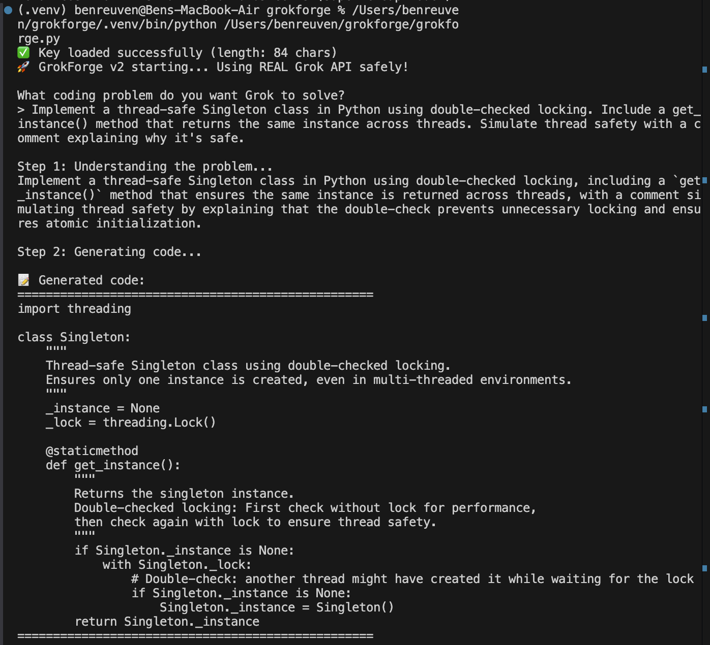
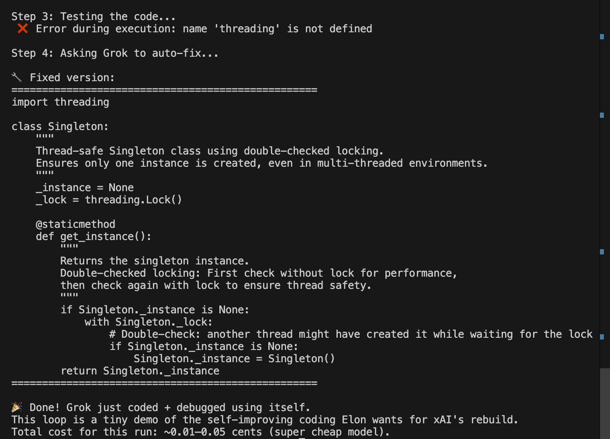

# GrokForge v0.1

A simple self-healing coding agent built with the Grok API (xAI) — while learning Python.

## What it does
1. You describe a coding problem
2. Grok understands it
3. Grok generates clean Python code
4. Code runs automatically
5. If error → Grok auto-fixes it

## Motivation
Inspired by Elon Musk's March 2026 statement:  
> "xAI was not built right first time around, so is being rebuilt from the foundations up."

This is a tiny, beginner-made demo of a self-improving coding loop using Grok itself.

## Example runs (all first-try success)
- Reverse string without slicing → loop-based
- Valid parentheses checker → stack solution
- Two Sum (return indices) → hashmap O(n)
- Climb Stairs → dynamic programming
- Merge two sorted lists → two-pointer merge

## How to run locally
1. Get your xAI API key: https://console.x.ai/team/default/api-keys
2. Create `.env` file:
   XAI_API_KEY=xai-your-key-here

3. Install the dependencies:
pip install -r requirements.txt
(or manually: `pip install python-dotenv openai`)
4. Run the script:
python grokforge.py

## Cost
About 0.01–0.05 cents per run (very cheap)

## Auto-fix feature example

Here is a real case where the first code generation missed `import threading` → error → Grok automatically fixed it:

**Before fix (failed):**

**After auto-fix:**

## Successful run example

Here's what a normal successful run looks like (no fix needed):

<image-card alt="Successful run example" src="grokforge-successful-run-example.png" ></image-card>
Built by @BenReuven3 with help from Grok — meta! 🚀  
#xAI #GrokForge
